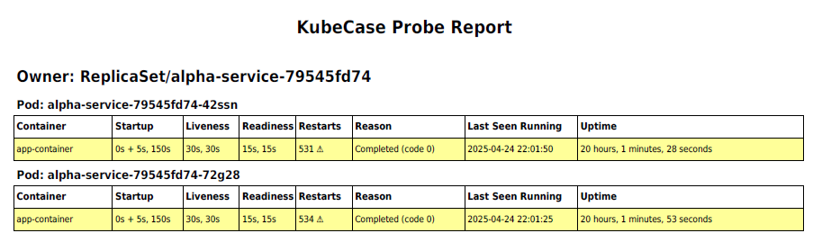
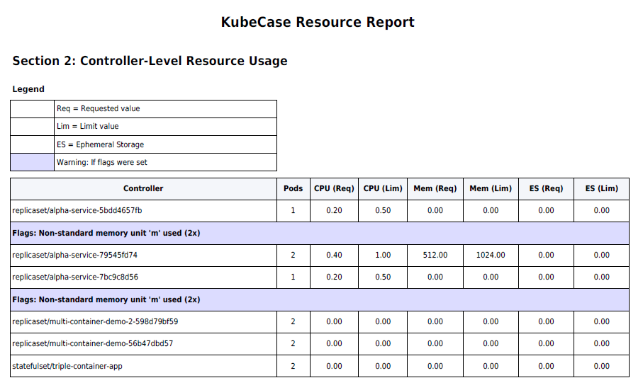
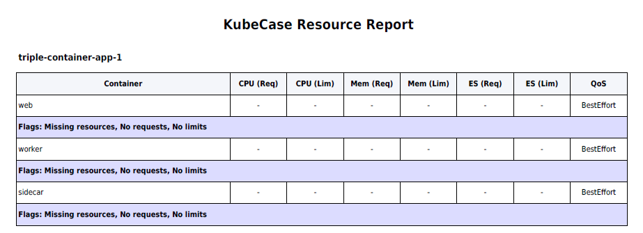
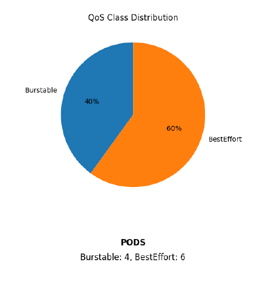

# 🕵️‍♂️ KubeCase

**Sniffing configs, one line at a time**  


---

## 📌 What is KubeCase?

**KubeCase** is your Kubernetes detective assistant. It is built to sniff out misconfigurations, report on health, and make troubleshooting faster and smarter. It delivers actionable insights into workload health through clean, readable reports with the flair of a golden doodle detective on the case. 🐶

---

## ✨ Features (v2.0)

### 🔍 Probe Report (PDF)
- Analyzes **startup**, **liveness**, and **readiness** probes
- Breaks down timing logic: initial delay and runtime sensitivity
- Highlights missing probes and aggressive configurations
- Includes cluster name, namespace, and summary
- Beautiful PDF layout with mascot, tables, and analysis

### 📊 Resource Requests & Limits Report (New!)
- **Namespace-wide quota summary**: shows total CPU, memory, and ephemeral storage allocations vs usage
- **Controller-level breakdown**: aggregates usage by owner (e.g., Deployment, StatefulSet)
- **Container-level insight**: detailed view of requests/limits per container with flags for missing or invalid configs
- **QoS Class analysis**:
  - Pie chart distribution (Guaranteed, Burstable, BestEffort)
  - Executive-friendly explanation of why QoS matters
- **Misconfiguration detection**:
  - CPU request > limit
  - Missing limits/requests
  - Memory request using incorrect `m` suffix (flagged)
- **Color-coded usage highlights** (Yellow ≥ 80%, Red ≥ 90%)
- **Multi-line wrapping support** for long Controller and Container names
- **Smart page breaks** with persistent headers
- **Early exit handling** if namespace has no pods (avoids generating empty reports)

### 🛡️ Pod Disruption Budget (PDB) Report (Under Development!)
- Calculates PDB coverage across all pods in the namespace
- Lists pods not protected by a PDB (e.g., lone jobs, sidecars, overlooked deployments)
- Simulates eviction scenarios: node reboots over time, constrained by PDB rules
- Breaks down PDBs by controller and configuration (minAvailable, maxUnavailable)
- Flags ineffective or overly restrictive PDBs that block upgrades

**Coming Soon:**
- 🔐 RBAC Relationship Viewer
- 🌐 Network Policy Inspector

---

## 📸 Example Output

<p align="center">
  
</p>
<p align="center">
  
</p>
<p align="center">
  
</p>
<p align="center">
  
</p>
<p align="center">
  
</p>

---

## 🚀 Getting Started

```bash
# Clone the repo
git clone https://github.com/kubecase/kubecase.git
cd kubecase

# Set up virtual environment
python3 -m venv venv
source venv/bin/activate  # or venv\Scripts\activate on Windows

# Install package (editable mode)
pip install -e .

# Generate a report using the CLI
kubecase generate -n my-namespace -r probe      # Probe Report
kubecase generate -n my-namespace -r resource   # Resource Report
kubecase generate -n my-namespace -r pdb        # PDB Report

# See available commands
kubecase --help
```

## 🧩 Requirements

    Python 3.8+
    kubectl or oc CLI with access to a Kubernetes cluster
    Permissions to query pod data in the target namespace

## 💡 Vision

KubeCase aims to become the go-to Kubernetes diagnostics toolkit. It combines human-readable reports with deep insights to help:

  - Platform teams keep clusters healthy
  - App teams troubleshoot faster
  - Everyone understand their workloads better

We believe powerful observability tools shouldn't require deep Prometheus or Grafana knowledge. They should be simple, visual, and explain themselves.

## 📦 Installation (Alt via GitHub)
You can install directly via pip from GitHub:
```bash
pip install git+https://github.com/yourusername/kubecase.git
```

Then run:
```bash
kubecase generate -n my-namespace -r resource
```

## 👥 Contributing

We welcome contributions, ideas, and collaboration!
Have a feature request or bug report? Open an issue or pull request.

## 📄 License
MIT License © 2025 Rey Linares
